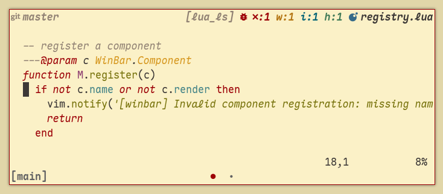

# WinBar

<p align="center">
    
</p>

<p align="center">- Configurable and minimal Neovim WinBar -<p>

## Components

- [x] LSP Clients
- [x] LSP Diagnostics
- [x] File Icon
- [x] Git Branch
- [x] Git Diff

### Status

- [x] Readonly status
- [x] Modified status

## Installation

Install with your preferred `plug-in manager`.

<details>
<summary>With <a href="https://github.com/folke/lazy.nvim">folke/lazy.nvim</a></summary>

```lua
{
  'mateconpizza/winbar.nvim',
  event = { 'BufReadPre', 'BufNewFile' },
  dependencies = {
    -- optional: add file icons to the winbar
    'nvim-tree/nvim-web-devicons',  -- or use 'nvim-mini/mini.icons' (WIP)

    -- optional: show git diff stats in the winbar
    'lewis6991/gitsigns.nvim',      -- or use 'nvim-mini/mini.diff'
  },
  ---@module 'winbar'
  ---@type winbar.config
  opts = {},
}
```
</details>

**Note**: You must call `require('winbar').setup()` to activate the plugin.

<details>
<summary>Default configuration</summary>

```lua
-- There's no need to include this in setup(). It will be used automatically.
require('winbar').setup({
  -- Core behavior
  enabled = true, -- Enable the WinBar plugin
  update_interval = 200, -- How much to wait in milliseconds before update (git diff, diagnostics)
  file_icon = true, -- Show file icon (e.g., via nvim-web-devicons)
  show_single_buffer = true, -- Show WinBar even with a single visible buffer
  exclusions = {
    filetypes = {
      -- Filetypes where WinBar will not be shown
      'aerial',
      'dap-float',
      'fugitive',
      'oil',
      'Trouble',
      'lazy',
      'man',
    },
    -- Buffer types where WinBar will not be shown
    buftypes = {
      'terminal',
      'quickfix',
      'help',
      'nofile',
      'nowrite',
    },
  },
  -- Icons used across components
  icons = {
    modified = '[+]', -- Shown for unsaved buffers (choice: ●)
    readonly = '[RO]', -- Shown for readonly buffers (choice: )
  },
  -- Diagnostics configuration
  diagnostics = {
    enabled = true, -- Show diagnostics (LSP/linters)
    style = 'standard', -- Display style ("standard" or "mini")
    bug_icon = '!', -- Icon shown before diagnostic counts (choice: 󰃤)
    show_detail = true, -- Show individual counts for each severity
    icons = { -- Diagnostic severity icons
      error = 'e:',
      hint = 'h:',
      info = 'i:',
      warn = 'w:',
    },
  },
  -- LSP client name display
  lsp = {
    enabled = true, -- Enable LSP client display
    separator = ',', -- Separator for multiple clients
    format = function(clients) -- Formatter for LSP client names
      return clients
    end,
  },
  -- Git display
  git = {
    branch = {
      enabled = true,
      icon = '', -- Git branch icon (choice: )
    },
    diff = {
      enabled = true,
      added = '+',
      changed = '~',
      removed = '-',
    },
  },
  -- Layout of the WinBar
  layout = {
    left = { 'git_branch', 'git_diff' }, -- Components aligned to the left
    right = { -- Components aligned to the right
      'lsp_status',
      'diagnostics',
      'modified',
      'readonly',
      'file_icon',
      'filename',
    },
  },
  -- Highlight groups
  styles = {
    winbar = { link = 'StatusLine' }, -- Active window WinBar highlight
    winbarnc = { link = 'Comment' }, -- Inactive window WinBar highlight
    lsp_status = { link = 'Comment' }, -- LSP client highlight
    readonly = { link = 'ErrorMsg' }, -- Read-only indicator highlight
    modified = { link = 'WarningMsg' }, -- Modified buffer indicator highlight
    git_branch = { link = 'Comment' }, -- Git branch highlight
    diffadded = { link = 'Added' }, -- Git diff added lines highlight
    diffchanged = { link = 'Changed' }, -- Git diff changed lines highlight
    diffremoved = { link = 'Removed' }, -- Git diff removed lines highlight
  },
})
```

</details>

## Highlight groups

| Group                  | Default      | Description                         |
| ---------------------- | ------------ | ----------------------------------- |
| `WinBar`               | StatusLine   | Active winbar highlight             |
| `WinBarNC`             | StatusLineNC | Inactive window WinBar highlight    |
| `WinBarGitBranch`      | Comment      | Git branch highlight                |
| `WinBarLspStatus`      | Comment      | LSP client highlight                |
| `WinBarReadonly`       | ErrorMsg     | Read-only indicator highlight       |
| `WinBarModified`       | WarningMsg   | Modified buffer indicator highlight |
| `WinBarGitDiffAdded`   | Added        | Git diff added lines highlight      |
| `WinBarGitDiffChanged` | Changed      | Git diff changed lines highlight    |
| `WinBarGitDiffRemoved` | Removed      | Git diff removed lines highlight    |
